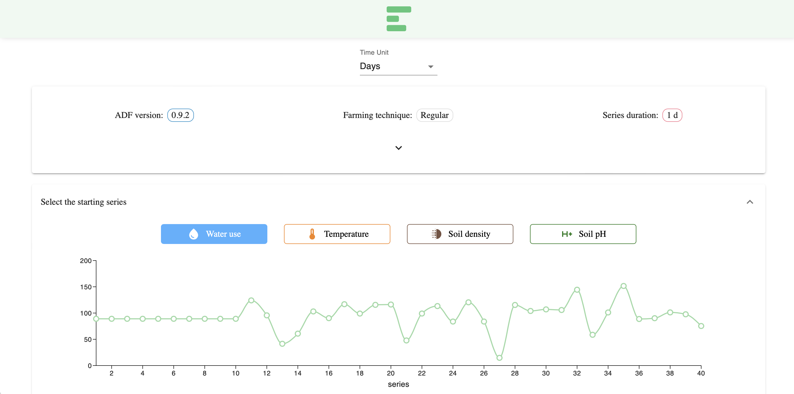
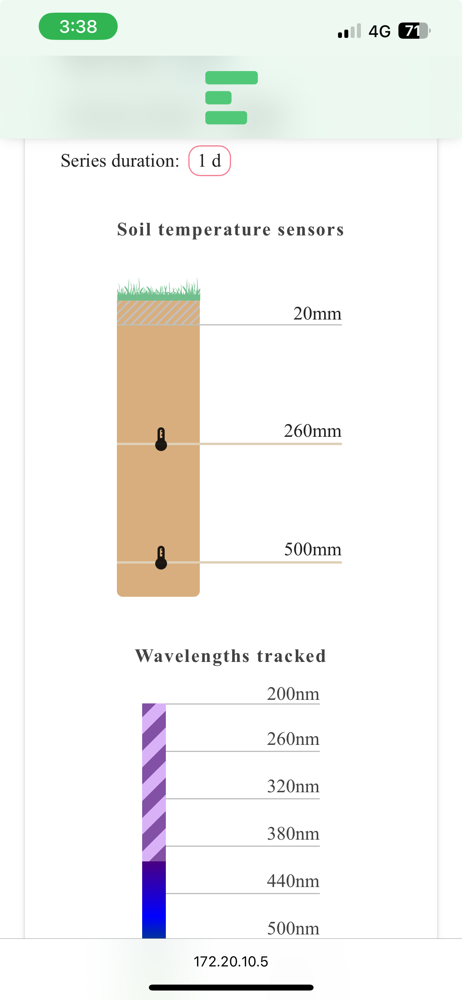

An interactive visualizer for ADF data

> "when you wear green spectacles, why of course everything you see looks green to you."
> 
> (_The Wonderful Wizard of Oz_)

## Build

Emerald it's a React application. to start it, run
```bash
npm start
```

As always, to create a production build run
```bash
npm run build
```

## Screenshots

Some screenshots are available in this section.

### Web version


### Mobile version

<div style="display: flex; column-gap: 30px; justify-content: space-around; align-items: start;">
	
	
</div>
<div style="display: flex; justify-content: center; margin-top: 30px;">
	
</div>
