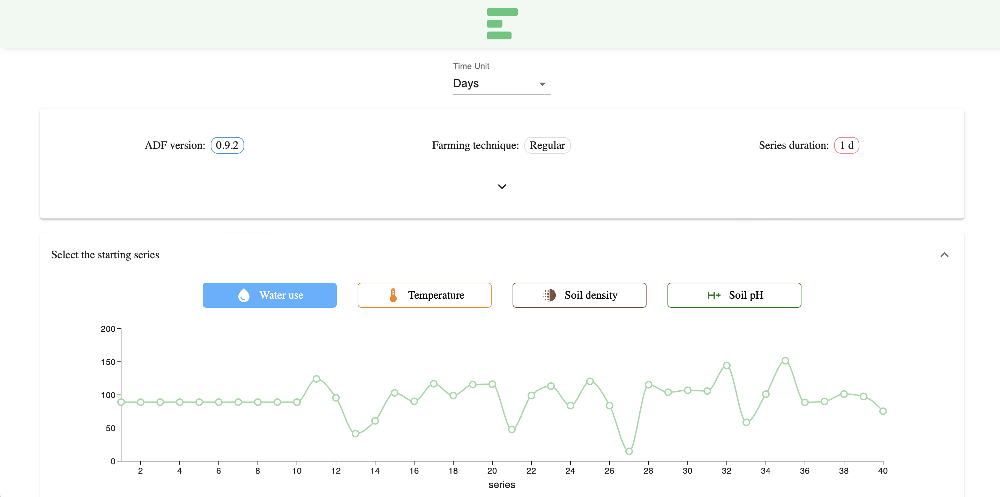
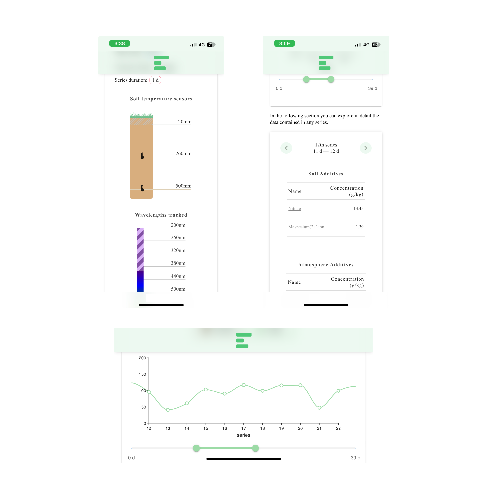

An interactive visualizer for ADF data

> "when you wear green spectacles, why of course everything you see looks green to you."
> 
> (_The Wonderful Wizard of Oz_)

## Build
[](https://github.com/TeriusProject/Emerald/actions/workflows/node.js.yml)

Emerald it's a React application. to start it, run
```bash
npm start
```

As always, to create a production build run
```bash
npm run build
```

## Screenshots

Some screenshots are available in this section.

### Web version


### Mobile version


